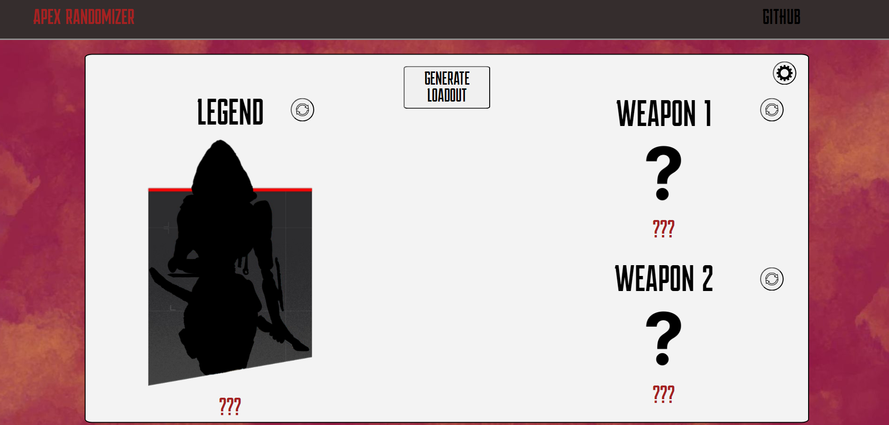

<h1>Apex Randomizer for S20 Split 1 in Java</h1>  
 
https://jasondinh345.github.io/ApexRandomizerP2/
 

<h2>Known Issues</h2>
The main problem with this with window scaling. Sometimes the program will run and the buttons will be offscreen <be>
Responsiveness on the navbar isnt fully implemented 
Respnsiveness is off sometimes on moblie

