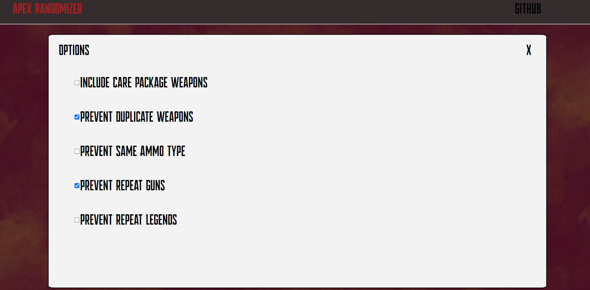

<h1>Apex Randomizer for S20 Split 1 in Java</h1>  

<h2> Link to Github Pages</h2> 

https://jasondinh345.github.io/ApexRandomizerP2/ 

<h2>Known Issues</h2>
Responsiveness on the navbar isnt fully implemented  
Responsiveness is off sometimes on moblie 
Doesn't work with mobile landscape 
Slow 

